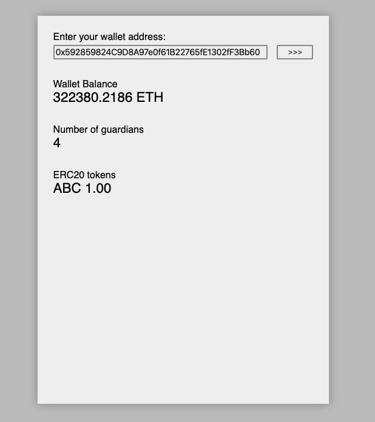

## Argent Task


<br/>

## Getting started
Don't warry be magic 🧙‍

🧙‍ Three magic lines to get started:
```sh
git clone git@github.com:hacker-dom/argent-task argent-task-hacker-dom
cd argent-task-hacker-dom
npm run start:noob
```
<br/>

## Development environment
🔥 DevServer with hot reloads on every change:
```sh
npm start
```

🔗 [http://localhost:8080](http://localhost:8080/)

## Answers to questions
- How long did you spend on the exercise?
  - 1 day and a bit. I worked on it on Saturday and finished it off this morning. :)
- What would you improve if you had more time?
  - Probably add `web3-eth-abi` in order to compute bytes of data in a programmatic manner. Ideally this would be computed at build time using `webpack.DefinePlugin`. :-)
- What would you like to highlight in the code?
  - Semantic HTML, [fluid CSS](https://www.youtube.com/watch?v=XR6eM_5pAb0), mocked Api, code splitting.
- How could you add authorization to this web-app, so only the wallet owner could lookup
their data?
  - Prompt the user to sign a message. Check if the . This is assuming Argent wallets implement [ERC-1271](https://github.com/ethereum/EIPs/issues/1271). However, this would have to be done on the client. Since all data is public, it would not be difficult to "hack" it and do it anyways :)